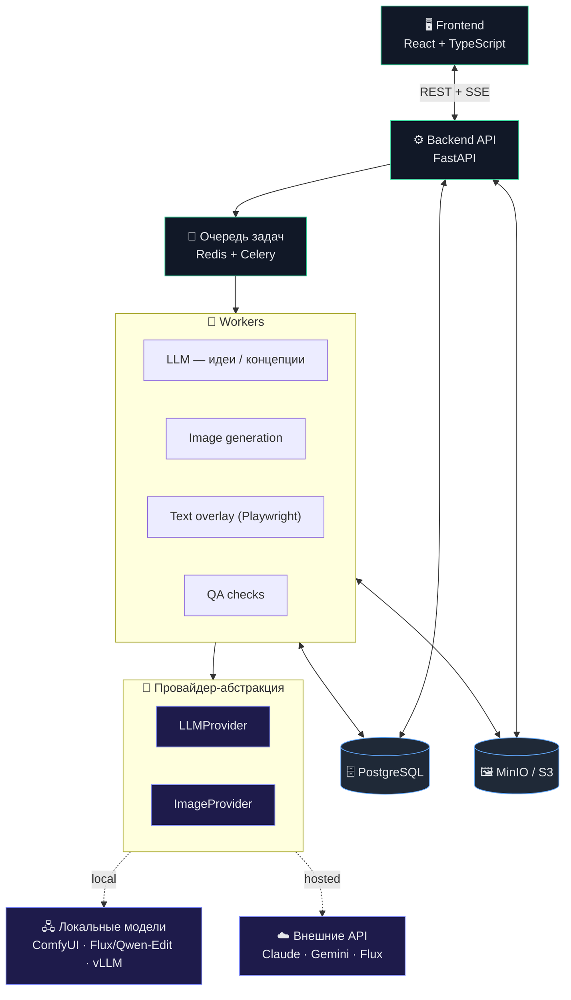
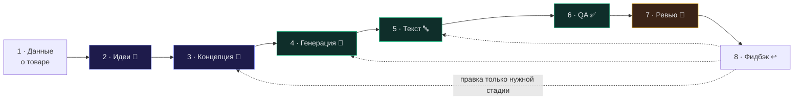

<div align="center">

# 🛍️ AI Marketplace Cards

### AI-система генерации визуальных карточек товара для маркетплейсов

Превращает фото и описание товара в готовый комплект продающих карточек для **Ozon**, **Wildberries** и **Яндекс Маркета** — с сохранением товара без искажений и итеративной правкой обычным текстом.


> 🚧 **Проект в активной разработке.** README описывает целевой продукт; часть функциональности и команд из раздела «Быстрый старт» появится по мере реализации (см. план в [docs_marketplace/plan.md](docs_marketplace/plan.md)).

</div>

---

## ✨ Возможности

- 🖼️ **Сохранение товара без искажений** — форма, цвет, детали, логотип и пропорции остаются как на оригинальном фото (editing-модели + композитинг).
- 💡 **Генерация идей карточек** — LLM предлагает набор слайдов, смыслы, акценты и визуальный стиль под товар и целевую аудиторию.
- 🎨 **Детальная визуальная концепция** каждой карточки: композиция, фон, инфографика, текстовые блоки, иконки, палитра.
- 🔤 **Чёткое наложение текста** отдельным графическим движком (HTML/CSS + Playwright), а не нейросетью — текст всегда читаем и соответствует правилам маркетплейсов.
- 💬 **Правки обычным текстом** — «сделай фон светлее», «текст крупнее», «убери лишнее»: система понимает фидбэк и перегенерирует только нужную стадию.
- 🕓 **История версий** каждой карточки и сравнение вариантов.
- 🔌 **Hosted ⇄ Local** — работает как на внешних API, так и полностью на локальных моделях в закрытом контуре.
- 📦 **Экспорт** готового комплекта под форматы маркетплейсов.

---

## 🏗️ Архитектура



---

## 🔄 Как это работает



1. **Менеджер** загружает фото и описание товара, указывает стиль бренда и требования.
2. **LLM** генерирует идеи карточек, затем детальную визуальную концепцию каждой.
3. **Генератор изображений** создаёт фон/сцену, сохраняя товар (editing-модель или композитинг).
4. **Движок текста** накладывает тексты и инфографику по шаблонам маркетплейсов.
5. **Авто-QA** проверяет: товар на месте, текст читаем, размеры верны.
6. **Менеджер** смотрит результат и правит обычным текстом → система перегенерирует только нужную стадию.

---

## 🧰 Технологический стек

| Слой | Технологии |
|------|-----------|
| **Backend** | Python 3.12, FastAPI, Celery, Redis |
| **Frontend** | React, TypeScript, Vite, TanStack Query, shadcn/ui |
| **Хранилища** | PostgreSQL (метаданные), MinIO/S3 (изображения) |
| **AI — LLM** | Claude API ⇄ локальный (vLLM / Ollama) через `LLMProvider` |
| **AI — Image** | Flux.1 Kontext, Gemini 2.5 Flash Image, Qwen-Image-Edit, ComfyUI ⇄ через `ImageProvider` |
| **Сегментация** | BiRefNet, SAM2 |
| **Текст/инфографика** | HTML/CSS + Playwright (Pillow — fallback) |
| **Наблюдаемость** | Langfuse / OpenTelemetry |
| **Инфраструктура** | Docker, docker-compose, uv, ruff, pnpm |

---

## 🚀 Быстрый старт

```bash
# 1. Клонировать репозиторий
git clone <repo-url> && cd marketplace

# 2. Настроить окружение
cp .env_example .env        # заполнить DATABASE_URL и ключи провайдеров

# 3. Поднять инфраструктуру (postgres, redis, minio, api, worker)
docker-compose up -d

# 4. Применить миграции
uv run alembic upgrade head

# 5. Запустить фронтенд
cd frontend && pnpm install && pnpm dev
```

После старта:

- **Веб-интерфейс:** http://localhost:5173
- **API + docs:** http://localhost:8000/docs

### Режимы работы

| Режим | Когда использовать |
|-------|--------------------|
| **Hosted** | Быстрый старт, без GPU — генерация через внешние API |
| **Local** | Закрытый контур, приватность бренд-данных — локальные модели (нужен GPU) |
| **Hybrid** | Баланс цены, качества и приватности |

Режим переключается в `.env` без изменения кода.

---

## 📁 Структура проекта

```
marketplace/
├── backend/            # FastAPI, пайплайн, провайдеры, Celery-воркеры
├── frontend/           # React + TypeScript SPA
├── docs_marketplace/               # idea.md, plan.md — задача и план разработки
├── docker-compose.yml  # api, worker, postgres, redis, minio
├── .env_example        # шаблон переменных окружения
└── README.md
```

---

## 📚 Документация

- [docs_marketplace/idea.md](docs_marketplace/idea.md) — постановка задачи.
- [docs_marketplace/plan.md](docs_marketplace/plan.md) — архитектура, пайплайн, модель данных, поэтапный план.
- [CLAUDE.md](CLAUDE.md) — контекст и соглашения проекта.

---

<div align="center">
<sub>Сделано с ❤️ для тех, кто продаёт на маркетплейсах</sub>
</div>
