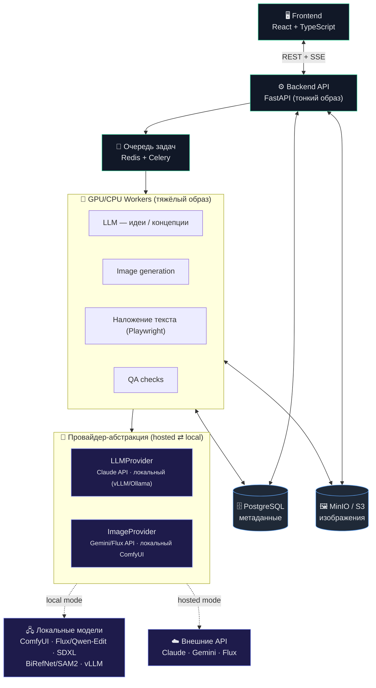
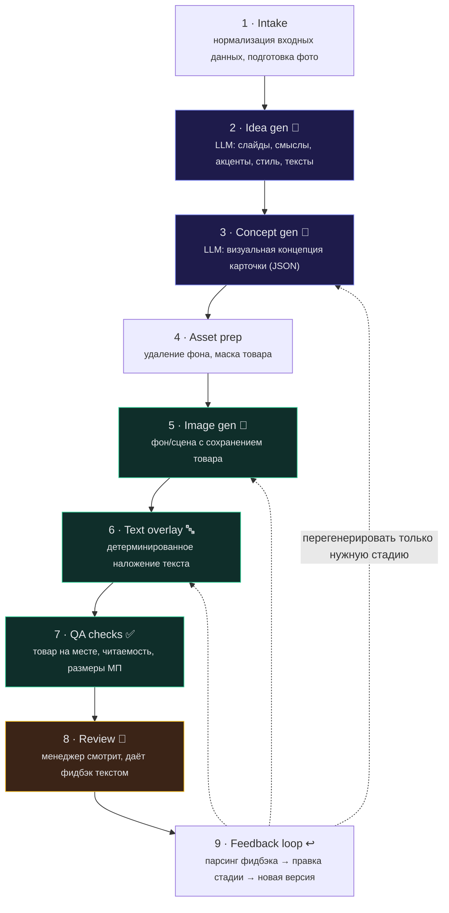
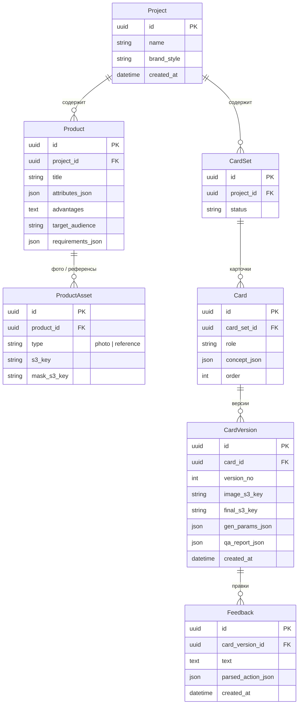

# План разработки: AI-система генерации карточек товара для маркетплейсов

> Базируется на [docs/idea.md](idea.md). Документ описывает архитектуру, технологический стек, пайплайн генерации, модель данных и поэтапный план работ от MVP до production.

---

## 1. Цели и границы

### Что делаем
Серверная система, которая по данным о товаре генерирует комплект визуальных карточек для маркетплейсов (Ozon, Wildberries, Яндекс Маркет) с итеративной правкой через текстовую обратную связь менеджера.

### Ключевая ценность (и главный риск)
**Сохранение товара без искажений** (форма, цвет, детали, логотип, пропорции). Это — основная техническая сложность и критерий успеха. Всё остальное (UI, очереди, БД) — стандартная инженерия.

### Принципы
- Текст на карточку накладывается **отдельным детерминированным этапом** (графический движок + шаблоны), а не нейросетью — это даёт читаемость, точность и попадание в требования маркетплейсов.
- Товар берётся с **реального фото** и сохраняется через editing-модели / композитинг / inpainting, а не «рисуется заново».
- Пайплайн — это набор изолированных, перезапускаемых стадий с сохранением артефактов на каждом шаге.
- **Провайдеро-независимость:** image- и LLM-генерация скрыты за абстракциями, что даёт работу как на внешних API, так и на **локальных моделях** (закрытый контур) без переписывания кода.

---

## 2. Целевая архитектура



### Компоненты
| Слой | Технология | Обоснование |
|------|-----------|-------------|
| Frontend | React + TypeScript + Vite | Внутренний SPA-дашборд (нет SEO/публичных страниц → SSR Next.js не нужен); статика раздаётся nginx без отдельного Node-сервера; API уже на FastAPI |
| Frontend (доп.) | TanStack Query + shadcn/ui | Управление серверным состоянием/кэшем запросов; готовый UI-кит ускоряет сборку дашборда |
| Backend API | Python 3.12 + FastAPI (тонкий образ) | Async, экосистема ML, удобно для пайплайнов. 3.12 — компромисс со зрелостью ML-стека. Образ без torch/CUDA — быстрый деплой |
| GPU/CPU Worker | Python 3.12 (тяжёлый образ) | Отдельный образ с torch/CUDA/ComfyUI-клиентом. Разделение зависимостей от API: ML-образ ~6–8 ГБ не тянется в каждый деплой API |
| Очередь | Redis + Celery | Многостадийный пайплайн: `chain`/`group`/`chord`, retry, routing ложатся на DAG почти 1:1. Альтернатива — ARQ (async-native) |
| БД | PostgreSQL | Проекты, товары, карточки, версии, фидбэк |
| Хранилище файлов | MinIO (S3 API) | Локально на сервере заказчика, S3-совместимо |
| LLM | `LLMProvider`: Claude API ⇄ локальный (vLLM/Ollama) | Генерация идей и структурированных концепций. Провайдер переключаем: облако или локальная модель (Qwen2.5-VL и т.п.) в закрытом контуре |
| Image generation | `ImageProvider`: Gemini/Flux API ⇄ локальный ComfyUI | Editing-модели + композитинг, см. раздел 4. Переключение hosted ⇄ local без переписывания пайплайна |
| Наложение текста | HTML/CSS-шаблоны + Playwright (headless Chromium) | Дизайнер авторит шаблоны привычными веб-средствами; сложная инфографика/типографика. Pillow — fallback для тривиальных подписей |
| Прогресс в UI | Server-Sent Events (SSE) | Однонаправленный поток сервер→клиент проще WS, легче за nginx, авто-reconnect |
| Наблюдаемость | Langfuse / OpenTelemetry | Трейсинг и учёт стоимости LLM/генерации на проект и карточку (риск «дорогая генерация») |
| Структурные контракты | Pydantic + tool-use/JSON-schema | Единый контракт для вывода LLM, API и БД — один источник правды для `concept_json` |
| Тулинг | uv + ruff (Python), pnpm (front) | Скорость установки/линтинга и воспроизводимость окружения |
| Контейнеризация | Docker + docker-compose | Воспроизводимое размещение на сервере заказчика |

---

## 3. Пайплайн генерации (ядро системы)

Стадии оформлены как независимые шаги; артефакт каждой стадии сохраняется и доступен для перезапуска/правки.



### Детализация стадий

**[2] Генерация идей (LLM)**
- Вход: характеристики, преимущества, ЦА, стиль бренда, примеры.
- Выход (structured JSON): список слайдов с ролью (обложка/преимущества/сценарий использования/состав/гарантии…), ключевыми смыслами, акцентами, тоном.

**[3] Визуальная концепция (LLM)**
- Для каждой карточки JSON-схема: композиция, позиция товара, фон, инфографика, текстовые блоки (текст + позиция + роль), иконки, цветовая палитра, «что должно быть / чего быть не должно».
- Этот JSON — единый контракт между LLM и движком наложения текста.

**[5] Генерация изображения — стратегия сохранения товара (КРИТИЧНО)**
Подход по убыванию надёжности сохранения:
1. **Editing-модель по инструкции** (основной режим): Flux.1 Kontext / Gemini 2.5 Flash Image / Qwen-Image-Edit — «оставь товар, измени фон/сцену» с reference. Проще и качественнее ручных графов.
2. **Композитинг** (gold standard): вырезаем товар (BiRefNet/SAM2), генерим только фон/сцену, вставляем товар обратно с тенями/refinement. Товар = 1:1 пиксели оригинала.
3. **Inpainting с маской товара**: маскируем товар, перегенерируем только окружение.
4. **ControlNet (canny/depth) + IP-Adapter**: когда нужна более «врощенная» сцена с жёстким контролем контуров.
5. **img2img с низким denoise** — только как fallback.
- LoRA — опционально на этапе production для повторяющихся товаров/бренд-стиля.
- Реализация через `ImageProvider`: hosted-API (Gemini/Flux) или локальный **ComfyUI** (Flux/Qwen-Edit/SDXL) — режим выбирается конфигом (см. раздел 4.1).

**[6] Наложение текста (отдельный движок)**
- Шаблоны под форматы маркетплейсов (Ozon/WB/ЯМ: размеры, safe-zones, лимиты текста).
- Движок: Pillow/Skia для простого, либо headless Chromium + HTML/CSS для сложной типографики и инфографики.
- Берёт текстовые блоки из JSON концепции (стадия 3) → рендерит поверх изображения.

**[7] QA-проверки (автоматические)**
- Товар присутствует и не искажён (сравнение эмбеддингов/SSIM по региону товара).
- Текст читаем (контраст, минимальный кегль).
- Размеры/соотношение сторон под требования МП.
- Нет «запрещённых» элементов из концепции.

**[9] Цикл обратной связи**
- LLM-классификатор разбирает свободный фидбэк («фон светлее», «текст мельче», «товар исказился») → определяет, какую стадию перезапустить и с какими дельта-параметрами.
- Перегенерируется только нужная стадия → копится история версий.

---

## 4. Выбор инструментов генерации изображений

Подход к сохранению товара строится на **современных instruction-based editing-моделях** (2025–2026), а не на ручных ControlNet-графах 2023 года. Это напрямую снижает главный риск проекта и упрощает пайплайн.

| Задача | Инструмент | Примечание |
|--------|-----------|------------|
| Удаление фона / маска | BiRefNet, RMBG-2.0, SAM2 | BiRefNet — SOTA по краям (волосы, стекло, упаковка). Локально, бесплатно |
| Сохранение товара (основной режим) | Editing-модель: Flux.1 Kontext / Gemini 2.5 Flash Image / Qwen-Image-Edit | «Оставь товар, измени фон/сцену» по инструкции + reference. Сильно проще ControlNet |
| Сохранение товара (gold standard) | Композитинг: вырез товара → генерация фона → вставка с тенями/refine | Товар = 1:1 пиксели оригинала. Когда нужна абсолютная точность |
| Сохранение товара (продвинутый) | ComfyUI: inpaint + ControlNet/IP-Adapter | Для «врощенной» сцены с жёстким контролем контуров |
| Генерация фона/сцены | Flux / SDXL (ComfyUI) или внешний API | Локально для контроля и цены |
| Upscale/refine | Real-ESRGAN, SUPIR | Финальное качество |
| Наложение текста | HTML/CSS + Playwright (Pillow — fallback) | Детерминированно, не нейросеть |

> Решение провайдеро-независимо: абстракции `ImageProvider` и `LLMProvider` позволяют переключать локальные модели и внешние API без переписывания пайплайна.

### 4.1. Режимы развёртывания (hosted / local / hybrid)

Один и тот же пайплайн работает в трёх режимах — выбор делается конфигом провайдеров, без изменения кода:

| Режим | Image / LLM | Когда выбирать | Плюсы / минусы |
|-------|-------------|----------------|----------------|
| **Hosted** | Gemini/Flux API + Claude API | Старт MVP, нет GPU на сервере | + Быстро к результату, ноль ML-ops, не нужен GPU.<br/>− Плата за вызов, данные уходят во внешний API |
| **Local** | ComfyUI (Flux/Qwen-Edit/SDXL) + локальный LLM (vLLM/Ollama, Qwen2.5-VL) | Закрытый контур, чувствительные бренд-данные, большой объём | + Приватность, ноль платы за генерацию, нет зависимости от внешних сервисов.<br/>− Нужен GPU (≥24 ГБ VRAM желательно), ML-ops, ниже потолок качества части моделей |
| **Hybrid** | Локальные модели + внешний API как fallback/для пиковой нагрузки | Прод после обкатки | Баланс цены, приватности и качества |

**Поддержка локальных моделей — обязательное требование архитектуры:**
- Все провайдеры реализуют единый интерфейс; локальный и hosted backend взаимозаменяемы.
- Локальные веса (BiRefNet, SAM2, Flux/Qwen-Edit, SDXL, LLM) монтируются как том и кэшируются; версии моделей фиксируются.
- Локальный LLM (через **vLLM** или **Ollama**) обслуживает стадии идей/концепций и парсинг фидбэка в офлайне.
- Конфигурация провайдеров — на уровне проекта/окружения (можно разные режимы для разных клиентов на одном сервере).

---

## 5. Модель данных (черновик)



> Отдельно — служебная таблица `Job (id, type, status, payload_json, result_json, error)` для отслеживания фоновых задач генерации.

---

## 6. API (ключевые эндпоинты)

```
POST   /projects                       создать проект
POST   /projects/{id}/products         загрузить товар (фото + описание)
POST   /products/{id}/ideas            запустить генерацию идей  → job
GET    /products/{id}/ideas            получить идеи
POST   /products/{id}/cards            сгенерировать концепции карточек → job
POST   /cards/{id}/generate            генерация изображения + текст → job
POST   /card-versions/{id}/feedback    текстовый фидбэк → новая версия (job)
GET    /jobs/{id}                      статус задачи
GET    /card-versions/{id}/download    скачать готовый вариант
GET    /jobs/{id}/events               прогресс генерации (SSE-поток)
```

---

## 7. Поэтапный план работ

> **Стратегия:** идём **API-first** — MVP собираем на hosted-моделях (без GPU, без ML-ops, быстрее к результату), затем подключаем локальные модели через те же провайдер-абстракции (Этап 6). Если GPU есть с самого начала — Этап 6 можно вести параллельно.

### Этап 0 — Подготовка (1 неделя)
- [x] Репозиторий (monorepo), структура, docker-compose (api, worker, postgres, redis, minio). _<!-- структура apps/{api,worker,frontend} + packages/shared; docker-compose.yml: postgres/redis/minio (+ minio-init бакета) рабочие и проверены, api/worker под профилем `app` (их Dockerfile — следующий пункт) -->_
- [x] Разделение образов: тонкий API и тяжёлый worker; тулинг uv/ruff/pnpm. _<!-- uv-воркспейс (apps/api, apps/worker, packages/shared) + общий ruff; два Dockerfile (тонкий API без torch / тяжёлый worker, ML/Playwright — опц. extra render/local); pnpm-воркспейс для apps/frontend. Образы собираются из корня репо, api проверен (/healthz → 200). Полный каркас app — следующий пункт -->_
- [x] Каркас FastAPI + React (TanStack Query, shadcn/ui), базовый CI, линтеры. _<!-- FastAPI-каркас (config.py на pydantic-settings, CORS, роутеры под /api + /healthz; ruff check/format чисто, OpenAPI отдаёт /api/health и /healthz). Каркас фронта apps/frontend (Vite+React18+TS, TanStack Query, shadcn/ui: Tailwind/CSS-переменные/Button, демо-запрос /api/health) + линтеры (ESLint flat + Prettier) + CI .github/workflows/ci.yml (python: uv+ruff; frontend: pnpm+eslint+prettier+tsc/build). `pnpm install` выполнен → корневой pnpm-lock.yaml перегенерирован (2.6k строк), `pnpm install --frozen-lockfile` проходит. Проверено: eslint (0 ошибок, 1 warning react-refresh на shadcn button — не блокирует), prettier --check чисто, tsc -b чисто, vite build успешен -->_
- [x] Абстракции `LLMProvider` / `ImageProvider` (интерфейс + hosted-реализации). _<!-- пакет marketplace_shared.providers: contracts.py (Pydantic-контракты LLM/Image + Usage), base.py (ABC LLMProvider.complete, ImageProvider.edit/generate, async), config.py (ProviderSettings на pydantic-settings + .env_example), echo.py (офлайн-провайдеры: EchoLLM детерминированный + болванка по JSON-schema, EchoImage.edit сохраняет товар 1:1), hosted.py (каркасы AnthropicLLMProvider/GeminiImageProvider: конфиг+ключ читаются, методы → ProviderNotImplemented), registry.py (фабрики get_llm_provider/get_image_provider по конфигу), errors.py. Дефолт — echo (без сети/ключей). ruff чисто, smoke-проверки (8 шт.) пройдены. Реальные сетевые вызовы hosted — следующие два пункта (Claude API / editing-API) -->_
- [x] Подключение Claude API + tool-use/JSON-schema, валидация Pydantic. _<!-- AnthropicLLMProvider.complete (providers/hosted.py) на официальном SDK anthropic (async-клиент AsyncAnthropic): structured-вывод по JSON Schema через output_config.format (response_schema → LLMResponse.data, json.loads), адаптивное мышление по умолчанию, модель claude-opus-4-8. Учтены особенности Opus 4.8: temperature/top_p НЕ передаются (иначе 400), budget_tokens не используется. Обработка stop_reason: refusal → ProviderError, max_tokens при structured → ProviderError (неполный JSON). usage (вкл. cache_*) маппится в Usage. Логика вынесена в чистые _build_kwargs/_parse_response — покрыта smoke-тестами (6 шт.) на фейках без сети/ключа. anthropic>=0.69 добавлен в shared (резолв 0.111). ruff чисто. Реальные сетевые вызовы требуют ANTHROPIC_API_KEY и LLM_PROVIDER=anthropic. JSON-контракт стадий [2]/[3] на Pydantic — наполняется в Этапе 1. -->_
- [x] Подключение editing-API (Gemini/Flux) — проверка «сохрани товар, смени фон». _<!-- GeminiImageProvider (providers/hosted.py) на официальном SDK google-genai (async-клиент client.aio), модель gemini-2.5-flash-image. edit (основной режим [5] «оставь товар, измени фон/сцену»: инструкция + входное фото + опц. референсы) и generate (фон с нуля). Вход ImageRef: inline-байты или presigned-URL (MinIO/S3) — url скачиваем сами через httpx, т.к. SDK берёт только Files-API URI. Выход — inline-байты из candidates[0].content.parts[].inline_data → ImageRef(data=...). Блокировки: prompt_feedback.block_reason и finish_reason кандидата → ProviderError; нет картинки → ProviderError. usage_metadata → Usage. Логика в чистых _build_contents/_build_config/_parse_response/_map_gemini_usage — покрыта smoke-тестами (19 шт.) на фейках без сети/ключа; сборка реальных объектов SDK (GenerateContentConfig, Part.from_bytes) проверена. В shared добавлены google-genai>=1.0 и httpx>=0.27 (резолв google-genai 2.9.0). ruff чисто. Реальные сетевые вызовы требуют GEMINI_API_KEY и IMAGE_PROVIDER=gemini. Flux/BFL (bfl_api_key зарезервирован в конфиге) — отдельный провайдер при необходимости; для проверки «сохрани товар, смени фон» достаточно Gemini. -->_

### Этап 1 — Текстовый пайплайн без картинок (1–2 недели)
- [x] Модель данных + миграции. _<!-- ORM-модель в packages/shared/marketplace_shared/db: base.py (DeclarativeBase + naming_convention для стабильных имён ограничений, TimestampMixin, uuid_pk), models.py (8 таблиц раздела 5: projects/products/product_assets/card_sets/cards/card_versions/feedback + служебная jobs; UUID-PK, JSONB, FK c ON DELETE CASCADE, индексы по FK и jobs.status), session.py (async-движок psycopg v3 + async_sessionmaker + get_session-зависимость FastAPI), config.py (DbSettings из DATABASE_URL, подстановка диалекта postgresql+psycopg). Alembic в корне: alembic.ini (url берётся из DATABASE_URL через env.py, post-write hook ruff), migrations/env.py (sync-движок psycopg, target_metadata=Base.metadata, compare_type/server_default), первая миграция migrations/versions/…_initial_schema.py. Применена к dev-БД `marketplace`: upgrade/downgrade-roundtrip ОК, `alembic check` — расхождений нет. ruff чисто. Зависимости shared: sqlalchemy[asyncio]>=2.0, psycopg[binary]>=3.2, alembic>=1.13. NB: async-движок на Windows требует SelectorEventLoop (psycopg+Proactor несовместимы) — учесть при локальном запуске API на Этапе 1; в Docker (Linux) проблемы нет. -->_
- [x] CRUD: проект → товар → загрузка фото/описания. _<!-- API-роутеры (apps/api/.../routers): projects.py (POST/GET список/GET по id), products.py (POST/GET в рамках проекта + GET /products/{id}), assets.py (POST загрузка фото/референса в MinIO + GET список с presigned-URL). DTO в schemas.py (Pydantic, отделены от ORM, from_attributes). Эндпоинты под /api: POST|GET /projects, GET /projects/{id}, POST|GET /projects/{id}/products, GET /products/{id}, POST|GET /products/{id}/assets. Хранилище — новый модуль marketplace_shared.storage (config.py: StorageSettings из S3_* env; s3.py: S3Storage на boto3 — put_object/presigned_get_url/ensure_bucket/delete_object, path-style для MinIO, singleton get_storage). Boto3-вызовы в async-эндпоинтах обёрнуты в run_in_threadpool. Загрузка через multipart (python-multipart), лимит 20 МБ, ключ products/{product_id}/assets/{asset_id}<ext>; изображение в БД не хранится. На Windows в main.py выставлена WindowsSelectorEventLoopPolicy (psycopg async несовместим с ProactorEventLoop; на Linux/Docker — no-op). Зависимости: boto3>=1.34 (shared), python-multipart>=0.0.9 (api). .env_example: добавлен S3_REGION. Проверено: ruff чисто, OpenAPI отдаёт все 6 эндпоинтов, ASGI-smoke на отдельной БД marketplace_test (CRUD + загрузка ассета с фейк-хранилищем, 404/400) — все проверки прошли. NB: реальная загрузка в MinIO требует поднятого docker-compose (minio был выключен при проверке). -->_
- [x] Стадия [2] генерация идей (LLM). _<!-- Провайдеро-независимая логика стадии — пакет marketplace_shared.pipeline (ideas.py): Pydantic-контракты ProductBrief (вход: характеристики/преимущества/ЦА/требования + стиль бренда из проекта) и ProductIdeas/IdeaSlide (выход: слайды с ролью/смыслами/акцентами/тоном) — они же единый источник JSON Schema (IDEAS_RESPONSE_SCHEMA = ProductIdeas.model_json_schema()) для structured-вывода LLM и валидации ответа; build_ideas_request (чистая, RU system-промт арт-директора + рекомендованные роли) и generate_ideas(provider, brief) (вызов LLMProvider.complete, валидация, ProviderError если нет structured-data). Хранение — новое nullable-поле products.ideas_json (JSONB) + миграция a10c0af96e25 (применена к dev-БД, alembic check чисто). API-роутер apps/api/.../routers/ideas.py: POST /products/{id}/ideas (синхронно на Этапе 1, без Celery; идемпотентно — 409 при повторе без force, force=true перетирает; 404 нет товара; 502 ProviderError) и GET /products/{id}/ideas (404 пока не сгенерировано); DTO IdeasGenerateRequest/IdeasRead. echo-стаб (_stub_from_schema) научён резолвить $ref/$defs — офлайн-дефолт даёт валидный ProductIdeas. ruff чисто. Проверено: smoke пайплайна на echo + ProviderError-кейс; end-to-end ASGI на отдельной БД marketplace_test (проект→товар→idea: 201/404/409/force/200). Постановка в очередь + job/SSE («→ job» из раздела 6) — Этап 2. -->_
- [x] Стадия [3] визуальные концепции (LLM, JSON-контракт). _<!-- Провайдеро-независимая логика — пакет marketplace_shared.pipeline (concepts.py): Pydantic-контракты TextBlock (текст+роль+позиция для движка текста [6]), CardConcept (композиция, позиция товара, фон, инфографика, текстовые блоки, иконки, палитра, must_have/must_not_have) и CardSetConcepts — они же единый источник JSON Schema (CONCEPTS_RESPONSE_SCHEMA) для structured-вывода LLM и валидации; build_concepts_request (чистая, RU system-промт арт-директора, в must_not_have закладывает запрет на искажение товара) и generate_concepts(provider, brief, ideas) — вход = бриф товара + идеи стадии [2]. Хранение — CardSet (+ карточки Card.concept_json), к CardSet добавлено nullable product_id (FK→products, ON DELETE CASCADE, индекс) + миграция fddc5f32557b (применена к dev-БД, alembic check чисто). API-роутер apps/api/.../routers/cards.py: POST /products/{id}/cards (синхронно на Этапе 1, без Celery; требует идей → 409 если ideas_json пуст; идемпотентно — 409 при повторе, force=true удаляет прежние наборы товара и генерирует заново; 404 нет товара; 502 ProviderError) и GET /products/{id}/cards (последний набор; 404 если нет). DTO ConceptsGenerateRequest/CardRead (concept ← concept_json)/CardSetRead. ruff чисто. Проверено: smoke пайплайна на echo (схема/$defs, build_request, generate, ProviderError) + end-to-end ASGI на marketplace_test (проект→товар→идеи→концепции: 409-без-идей/404/201/409-повтор/force/404). Постановка в очередь + job/SSE («→ job» из раздела 6) — Этап 2. -->_
- [x] UI: создание проекта, ввод данных, просмотр идей и концепций. _<!-- Применён скилл frontend-design: тема «ателье» (тёплая тёмная по умолчанию + светлая «бумага» с переключателем в шапке, выбор в localStorage), шрифты Unbounded/IBM Plex Sans/JetBrains Mono (полная кириллица), янтарный акцент, плёночное зерно, мотив нумерованных стадий [2]/[3]. SPA на хэш-роутере без новых зависимостей (lib/router.ts): #/ проекты → #/projects/:id проект → #/products/:id товар. Экраны: ProjectsView (список + создание проекта), ProjectView (товары проекта + создание товара с характеристиками/требованиями «ключ: значение»), ProductView (данные товара, AssetsPanel — загрузка фото/референсов в MinIO с превью по presigned-URL, IdeasPanel — стадия [2] генерация/просмотр/перегенерация, ConceptsPanel — стадия [3] с полным контрактом концепции: композиция/подача товара/фон, текстовые блоки, палитра-свотчи, инфографика/иконки, must_have/must_not_have). Типизированный API-клиент lib/api.ts (ApiError со статусом, 404→пустое состояние, 409/502→ошибки), TanStack Query. UI-кит: input/textarea/field/panel/badge/states + AppShell (шапка с индикатором API-online через /api/health + хлебные крошки). Проверки: pnpm format:check/eslint (0 ошибок; 3 некритичных warning react-refresh)/tsc -b/vite build — зелено; визуально проверено вживую (API+Vite) на сквозном потоке проект→товар→идеи→концепции, обе темы. Требование frontend-design + две темы распространяется на весь UI проекта (Этап 4). NB (Windows): локальный запуск API под uvicorn требует SelectorEventLoop (asyncio.run(server.serve(), loop="none")); Node-прокси Vite на порт 8000 может ловить ECONNRESET — поднимать API на другом порту и задавать VITE_API_TARGET (см. vite.config.ts). -->_

### Этап 2 — Генерация изображений с сохранением товара (2–3 недели) ⭐ ключевой риск
- [x] Стадия [5] основной режим: editing-модель (Flux Kontext / Gemini) через `ImageProvider`. _<!-- Провайдеро-независимая логика стадии — пакет marketplace_shared.pipeline (imagegen.py): build_edit_instruction(concept, brand_style) (чистая, RU) собирает инструкцию редактирования из CardConcept (фон/сцена, подача товара, композиция, палитра, must_not_have), обрамляя её инвариантом «товар без искажений» (форма/цвет/детали/логотип/пропорции — менять только фон) и запретом наносить текст (текст — отдельная детерминированная стадия [6]); generate_card_image(provider, product_photo, concept, references, brand_style, model, size, seed) → ImageEditRequest → ImageProvider.edit, возвращает (ImageResult, instruction). Используется уже готовый ImageProvider/GeminiImageProvider.edit (Этап 0); дефолт echo сохраняет товар 1:1. В S3Storage добавлен get_object(key)→bytes: фото товара читается из MinIO и передаётся провайдеру inline-байтами (без presigned-round-trip), результат пишется обратно. API-роутер apps/api/.../routers/generate.py: POST /cards/{id}/generate (синхронно на Этапе 2; берёт концепцию карточки [3] + фото товара type=photo + опц. референсы, создаёт новую CardVersion с image_s3_key и gen_params_json {stage/provider/model/seed/instruction/usage}; 404 нет карточки; 409 нет концепции/привязки к товару/фото; 503 ProviderNotConfigured; 502 ProviderError или нет байтов) и GET /cards/{id}/versions (история версий с presigned-URL). DTO CardImageGenerateRequest/CardVersionRead. ruff чисто. Проверено: офлайн-smoke пайплайна на echo (инструкция содержит фон/подачу/палитру/запреты + товар возвращается 1:1) и end-to-end ASGI на marketplace_test с фейк-хранилищем (404/409-без-фото/201 v1 с сохранением байтов товара 1:1/201 v2/список версий). Постановка в очередь Celery + SSE-прогресс («→ job» из раздела 6) — следующий пункт этапа. Реальные сетевые вызовы требуют GEMINI_API_KEY и IMAGE_PROVIDER=gemini + поднятого MinIO. -->_
- [x] Стадия [4] удаление фона + маска (BiRefNet/SAM2). _<!-- Введён третий тип провайдера MattingProvider (providers/base.py) + контракты MattingRequest/MattingResult (маска grayscale + вырез RGBA с прозрачным фоном) в contracts.py. Реализация SimpleMattingProvider (providers/matting.py): офлайн-кеинг по цвету фона на Pillow (цвет фона из 4 углов кадра → порог по разнице + медианный фильтр), без GPU/весов — годится для API-first MVP (товар на однотонном фоне); чистая функция compute_matte(bytes)→(mask_png, cutout_png) тестируема без сети. Локальные BiRefNet/SAM2 (SOTA по сложным краям) зарезервированы в реестре (get_matting_provider, MATTING_PROVIDER, дефолт 'simple') как ProviderNotImplemented — полноценно на Этапе 6. Стадия пайплайна prepare_asset (pipeline/assets_prep.py) — провайдеро-независимая обёртка с валидацией. API: POST /products/{id}/assets/{asset_id}/mask (синхронно на Этапе 2; маска и вырез пишутся в MinIO по ключам {asset}.mask.png/{asset}.cutout.png, mask_s3_key сохраняется в ProductAsset; только для type=photo→400 иначе; 404 нет ассета; 409 идемпотентность + force; 501 birefnet/sam2; 503/502 ошибки провайдера). DTO ProductAssetRead расширен mask_url/cutout_url (presigned), MaskGenerateRequest. В shared добавлен pillow>=10.3 (лёгкий, не torch — допустим в тонком API). .env_example: MATTING_PROVIDER/MATTING_MODEL. ruff чисто. Проверено: офлайн-smoke compute_matte/prepare_asset на сгенерированном изображении (синий квадрат на белом → маска выделяет товар, вырез прозрачен на фоне) + birefnet/sam2→ProviderNotImplemented; end-to-end ASGI на marketplace_test с фейк-хранилищем (404/400-референс/200 с сохранением маски и выреза/409/force/список). Постановка в очередь Celery + SSE — следующий пункт этапа. -->_
- [x] Стадия [5] композитинг товара на сгенерированный фон (gold standard). _<!-- В pipeline/imagegen.py добавлен режим композитинга: build_background_prompt(concept) (чистая — промт ТОЛЬКО сцены: фон/композиция/палитра/бренд, без товара и текста, центр свободен под товар), generate_card_background(provider, concept) (вызов ImageProvider.generate), composite_product_on_background(bg_png, cutout_png) (чистая, Pillow: фон масштабируется под размер выреза, alpha_composite — пиксели товара 1:1, результат RGB PNG). Вырез берётся из стадии [4] (ключ {asset}.cutout.png). EchoImageProvider.generate теперь отдаёт реальный сплошной PNG-фон (детерминированный по seed/size) вместо echo-ссылки — композитинг гоняется офлайн. API: POST /cards/{id}/generate получил поле mode=edit|composite (CardImageMode); composite требует маску товара (стадия [4]) → 409 если нет; gen_params_json.stage=image_composite + background_prompt. Оба режима создают CardVersion. ruff чисто. Проверено: офлайн-smoke (build_background_prompt без товара/текста; composite — товар 1:1, фон заполнен; echo.generate отдаёт байты нужного размера) + end-to-end ASGI на marketplace_test (composite без маски→409, после [4]→201 с товаром 1:1 и заменённым фоном, edit-режим сохранён, история версий). Тени/refinement при вставке (упомянуты в разделе 4) — возможное улучшение позже. -->_
- [x] Очередь Celery (`chain`/`group`) + worker'ы, SSE-прогресс. _<!-- Архитектура API→очередь→worker: тяжёлые стадии [4]/[5] исполняет worker, API лишь ставит задачу и отдаёт Job (202). Sync-доступ к БД для синхронных Celery-задач — get_sync_engine/get_sync_sessionmaker/sync_session_scope (shared/db/session.py). Job расширён полями progress(0–100)/stage + миграция 35e94f2bccf9 (server_default=0 для backfill, затем снят; alembic check чист). Константы статусов/типов задач и имён Celery-задач — shared/jobs.py (контракт API↔worker без взаимных импортов). Worker: celery_app.py (json-сериализация, CELERY_TASK_ALWAYS_EAGER из env, регистрация tasks), stages.py (sync-оркестрация стадий [4]/[5] — перенесена из синхронных роутеров Этапа 1; провайдеры async → asyncio.run; storage sync), jobs.py (lifecycle mark_running/set_progress/mark_success/mark_failure с commit на каждый шаг — для SSE), tasks.py (asset_matting_task [4], card_image_task [5], finalize_card_set_task; build_card_set_canvas = chord(group(card_image…), finalize), при prepare каждая карточка — chain(matting, composite)). API: enqueue.py (тонкий клиент Celery, постановка задач ПО ИМЕНИ и name-based signature/group/chord/chain — без импорта кода воркера, образ остаётся тонким); роутеры переведены на постановку — POST /cards/{id}/generate (202, JobRead), POST /card-sets/{id}/generate (group/chord, prepare→chain; 202), POST /products/{id}/assets/{id}/mask (202); новый jobs.py — GET /jobs/{id} (статус) и GET /jobs/{id}/events (SSE text/event-stream: опрос строки Job свежей сессией, события progress до терминального статуса + done). Лёгкие LLM-стадии [2]/[3] оставлены синхронными (от них зависит UI Этапа 1). .env_example: CELERY_TASK_ALWAYS_EAGER. ruff чисто. Проверено (Redis не нужен): worker eager на marketplace_test+фейк-хранилище — asset_matting/card_image(edit), и полный chord(group(chain(matting,composite))) на наборе (parent success, composite-версии созданы); API ASGI (мок enqueue) — /cards/generate и /mask → 202+Job pending+enqueue с job.id, /card-sets/generate → parent+дочерние jobs (chain), GET /jobs (+404), SSE → progress+done. Реальный прогон через брокер требует поднятого Redis + запущенного worker (docker compose --profile app). Контент-адресуемый кэш артефактов — следующий пункт. -->_
- [x] Контент-адресуемый кэш артефактов стадий (для «правка только нужной стадии»). _<!-- Новый модуль marketplace_shared.pipeline.cache: чистые stage_digest (SHA-256 по канон. JSON-параметрам + sha256 каждого бинарного входа; порядок ключей не влияет) / artifact_key ({prefix}/{stage}/{digest}.{suffix}, суффикс сохраняет соглашение mask.png↔cutout.png) / StorageLike (Protocol) / StageCache (key/exists/get/put над хранилищем); PipelineSettings (PIPELINE_CACHE_ENABLED=true, PIPELINE_CACHE_PREFIX=cache). В S3Storage добавлен object_exists (HEAD, без чтения тела). Интеграция в worker/stages.py: перед дорогим вызовом провайдера стадия считает digest входов и смотрит кэш — попадание переиспользует артефакт без вызова. [4] matting: digest = фото + provider-класс + model → cache/matting/{d}.mask.png (+.cutout.png), mask_s3_key теперь контент-адрес (прежний _mask_key удалён). [5] edit: digest = фото + референсы + concept_json + brand_style + provider/model/size/seed → cache/image_edit/{d}.png. [5] composite: digest = вырез + референсы + concept + параметры → cache/image_composite/{d}.png (генерация фона пропускается при попадании). CardVersion.image_s3_key указывает на контент-адрес — новая версия с неизменными входами ссылается на тот же объект, провайдер не вызывается; gen_params_json получил cached/digest. Возвраты стадий получили cached. ruff чисто. Проверено: офлайн-smoke cache-примитивов (детерминизм/чувствительность digest, ключи, StageCache на фейк-хранилище) + eager E2E на marketplace_test с фейк-хранилищем и провайдерами-счётчиками — [4]/[5] edit/composite: miss→hit (провайдер вызван 1 раз, ключ переиспользован), смена seed→miss, cache off→всегда пересчёт, история версий копится. NB: реальный прогон требует MinIO (object_exists/HEAD). -->_
- [ ] Сравнение подходов на реальных товарах заказчика, выбор дефолта.

### Этап 3 — Наложение текста и инфографики (1–2 недели)
- [x] Движок рендера: HTML/CSS-шаблоны + Playwright (Pillow — fallback). _<!-- Новый пакет marketplace_shared.textrender (по паттерну провайдер-слоя): contracts.py (backend-независимые RenderBlock [text/position сетка 3×3/font_size/color/weight/align/max_width/background/padding], Canvas, RenderRequest [base_image + blocks + опц. canvas + опц. сырой html-оверлей], RenderResult); base.py (ABC TextRenderer.render async + общий _load_base: разрешение ImageRef inline/URL и масштабирование под холст); pillow.py (PillowTextRenderer — офлайн-fallback и дефолт: чистые wrap_lines [перенос по словам] / anchor_xy [якорь по сетке] / render_blocks; автоподбор TTF с кириллицей DejaVu/Arial → load_default(size); плашки-бейджи, выравнивание, safe-margin 4%); playwright.py (PlaywrightTextRenderer — основной режим: чистая build_overlay_html строит прозрачный оверлей из блоков с экранированием [сырой html имеет приоритет], headless Chromium → screenshot omit_background → alpha_composite на изображение; ленивый импорт playwright → RendererNotAvailable при отсутствии extra render); config.py (TextRenderSettings: TEXT_RENDERER дефолт 'pillow', TEXT_RENDER_FONT); registry.py (get_text_renderer/available_text_renderers); errors.py (TextRenderError/RendererNotConfigured/RendererNotAvailable). .env_example: TEXT_RENDERER/TEXT_RENDER_FONT. ruff чисто. Проверено офлайн: Pillow-рендер 4 блоков (заголовок/бейдж с красной плашкой/перенос/центр) на холсте 800×600 — текст нанесён, бейдж отрисован; масштабирование холста 400×300; чистые wrap_lines/build_overlay_html (блоки→HTML, center, экранирование <&, приоритет raw); playwright корректно деградирует без браузера (RendererNotAvailable); неизвестный TEXT_RENDERER → RendererNotConfigured. Шаблоны МП (Ozon/WB/ЯМ, safe-zones) и маппинг текстовых блоков концепции [3] в RenderBlock — следующие пункты Этапа 3; интеграция в worker/пайплайн как стадия [6] — там же. NB: реальный Playwright-рендер требует `uv sync --extra render` + `playwright install chromium`. -->_
- [x] Шаблоны под Ozon / WB / Яндекс Маркет (размеры, safe-zones). _<!-- textrender/templates.py: каталог MarketplaceTemplate (key/marketplace/title/canvas рекоменд./min_canvas/aspect_ratio/safe_zone/white_background_required/max_text_blocks/notes) — данные, не код. 4 встроенных формата по публичным требованиям МП (2026): ozon-main (1:1, 1000², белый фон, safe 6%, ≤4 блока), ozon-promo (3:4, 1080×1440), wildberries-main (3:4, 900×1200, нижняя safe-zone 8% под подписи WB), yandex_market-main (1:1, 1000², min 600², белый фон). API: get_template(key|None→дефолт ozon-main, KeyError с подсказкой)/list_templates/templates_for(mp)/available_template_keys. Safe-zone подключена к рендереру: в contracts добавлены SafeZone (отступы в долях сторон + .box(canvas)→пиксели) и RenderRequest.safe_zone; Pillow (_default_box→safe_zone.box, блоки размещаются в безопасной зоне) и Playwright (_safe_padding_css: padding контейнера по сторонам из safe_zone) её учитывают — шаблоны рабочие, не инертные. ruff чисто. Проверено офлайн: каталог (4 ключа/ratio/фильтр по МП/дефолт/неизвестный→KeyError), SafeZone.box в пикселях (WB → (45,60,855,1104)), рендер с холстом+safe-zone шаблона (масштаб под 900×1200), сдвиг контента при большей зоне, padding безопасной зоны в HTML-оверлее. Маппинг текстовых блоков концепции [3] в RenderBlock по шаблону (с учётом max_text_blocks/ролей) + интеграция стадии [6] в worker — следующий пункт Этапа 3. -->_
- [ ] Рендер текстовых блоков из JSON концепции поверх изображения.

### Этап 4 — Цикл обратной связи (1–2 недели)
- [ ] LLM-парсер свободного фидбэка → действие + стадия + дельта-параметры.
- [ ] Перегенерация нужной стадии, история версий.
- [ ] UI: просмотр версий, ввод фидбэка, сравнение вариантов.

### Этап 5 — QA, экспорт, полировка (1–2 недели)
- [ ] Авто-QA (товар на месте, читаемость, размеры).
- [ ] Скачивание/экспорт комплекта (zip, под форматы МП).
- [ ] Обработка ошибок, ретраи, логирование, наблюдаемость (Langfuse/OTel + учёт стоимости).

**Итог MVP** покрывает все 9 пунктов раздела «Что хотим получить» из [idea.md](idea.md): проект → загрузка → идеи → концепции → изображения → текст → фидбэк → новая версия → скачивание.

### Этап 6 — Локальные модели / закрытый контур (2–3 недели)
> Включается, когда нужны приватность, снижение цены за генерацию или офлайн-работа. Требует GPU.
- [ ] Локальная реализация `ImageProvider`: ComfyUI (Flux/Qwen-Image-Edit/SDXL), BiRefNet/SAM2.
- [ ] Локальная реализация `LLMProvider`: vLLM/Ollama (напр. Qwen2.5-VL) для идей/концепций/фидбэка.
- [ ] Монтирование и версионирование весов моделей (том + кэш).
- [ ] Конфиг режима (hosted / local / hybrid) на уровне окружения/проекта.
- [ ] Сравнение качества/скорости local vs hosted на товарах заказчика.

### Этап 7 — Размещение на сервере заказчика
- [ ] docker-compose / деплой (профили с/без GPU), бэкапы БД и MinIO.
- [ ] Документация для менеджеров.
- [ ] Нагрузочная проверка очередей.

---

## 8. Риски и митигации

| Риск | Влияние | Митигация |
|------|---------|-----------|
| Нейросеть искажает товар | Критично | Editing-модель + композитинг (товар = реальные пиксели) как gold standard, inpaint/ControlNet как продвинутый режим, авто-QA сравнением |
| Текст нейросетью нечитаем/кривой | Высокое | Текст накладывается отдельным детерминированным движком (HTML/CSS + Playwright) по шаблонам |
| Нет GPU на сервере | Высокое | API-first MVP на hosted-моделях; локальные модели — отдельный включаемый этап |
| Долгая/дорогая генерация | Среднее | Кэш стадий, перегенерация только изменённой стадии, переход на локальные модели, учёт стоимости (Langfuse) |
| Утечка чувствительных бренд-данных | Среднее | Режим local: всё в закрытом контуре на локальных моделях, без внешних API |
| Фидбэк понят неверно | Среднее | LLM-классификатор + предпросмотр действия перед перегенерацией |
| Несоответствие требованиям МП | Среднее | Шаблоны с зашитыми размерами/safe-zones + QA-проверка |
| Привязка к одному провайдеру | Низкое | Абстракции `ImageProvider` / `LLMProvider`, переключаемые бэкенды (hosted ⇄ local) |

---

## 9. Открытые вопросы к заказчику

1. Доступный сервер: есть ли GPU (модель/VRAM)? От этого зависит, когда подключать локальные модели (Этап 6).
2. Приоритет режима: hosted (быстрее и дешевле на старте) или local/закрытый контур (приватность бренд-данных) важнее с самого начала?
3. Объём: сколько товаров/карточек в день ожидается (для масштабирования очередей)?
4. Брендбук/шаблоны: есть ли фиксированные требования по шрифтам, цветам, лого?
5. Языки карточек (только RU?) и целевые маркетплейсы в приоритете.
6. Бюджет на внешние API генерации (для hosted-режима, пока/если нет локальных мощностей).
7. Нужна ли мультипользовательность / роли / авторизация в MVP.
